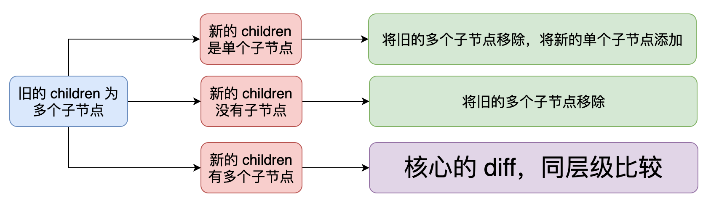

/*
* @Author: Zhang Guohua
* @Date:   2020-05-09 18:33:15
* @Last Modified by:   zgh
* @Last Modified time: 2020-05-21 20:08:09
* @Description: create by zgh
* @GitHub: Savour Humor
*/


## 组件

- 模板引擎： string + data => html.
- 组件的本质： 模板引擎，一个函数，通过给定数据，渲染对应的 html 数据。
- 组件的产出： vue/react 产出的是 virtual DOM.
    + render 函数才是最重要的， data, computed props 等都是数据源。
    + render 本来可以直接产出 html, 但是却没有。他采用的不是完全替换，而是 patch. 进行 dom 对比，来进行数据更新。
    + virtual dom 带来了分层设计，对渲染过程进行抽象，使得框架可以渲染到 web 以外的平台，以及能够实现 ssr.
        * 至于 virtual dom 与 原声 dom 操作的性能差异，并不是 virtual dom 的最终目标。并且，要比较性能是要控制变量的，比如页面大小，数据变化量。
- VNode: 用对象，描述 DOM 节点。
    + vNode -> 真实的 DOM: 需要 render 函数。
        * 元素的 tag -> 元素， 组件的 tag -> 组件。
- 组件： 可以通过 function 和 class 来描述。
    + functional component: 纯函数，没有自身状态，只接受外部数据。产出 vNode 方式： 单纯的函数调用。
    + 有状态的组件(stateful component): 类，可以实例化；有状态；产出 vNode 方式，需要实例化，调用 render 函数。


## Vnode
组件的产出，渲染器的目标都是 vNode; 设计 vNode 本身就是在设计框架；

- vNode 描述：
    + tag, data, children, text, 
    + 设计什么样的属性来描述都没有问题，但要在尽可能保证语义能够说得通的情况下复用属性，会使 vNode 对象更加轻量。
- 使用 vNode 描述抽象内容：
    + 组件： 增加一个标示，来表示 vNode 到底是普通的 html, 还是组件。 可以用 tag 的类型，字符串为普通 html 标签。
    + Fragment: 抽象标示，渲染一个片段，根源素并不真实存在。 添加一个 flags 属性，表示类型。
    + Portal: 允许你把内容渲染到任何地方。即提供指定的目标，将子节点渲染到给定的目标下。
- vNode 的种类： 不同的 vNode 有不同的设计，我们完全可以将其划分为不同的类型。
    + html/svg, component, text, Fragment, portal.
    + component: function, stateful (普通， 需要被keepAlive, 已经被 keepAlive)
- flags 作为 vNode 标示： 既然有类别，就添加标示。添加 flags 也是 virtual DOM 算法优化手段之一。
    + Vue2 中区分 vNode 种类这么做： 先当组件处理，如果创建成功，就是组件，否则，检查 tag 是否有定义，如果有则当作普通标签，如果没有检查是否是注视节点，如果不是，则是文本节点。
    + 一个 vNode 描述什么，这些都是在 挂载/patch 阶段进行，带来两个问题： 无法从 AOT (预编译)层面进行优化，开发者无法手动优化。
    + 通过 flags 标明，避免很多耗性能的判断，通过位运算符再次提升运行时性能。 flags & VNodeFlags.ELEMENT
    + Vue3 采用的是 inferno 手段。
- 枚举 vNodeFlags: 通过枚举/对象来进行表示，例如：
    + 通过枚举属性，派生出额外三个标示。ELEMENT， COMPONENT_STATEFUL， COMPONENT
    + 判断 vNode 类型，通过按位与 & 运算。使用位运算的技巧。
```js
const VNodeFlags = {
  // html 标签
  ELEMENT_HTML: 1,
  // SVG 标签
  ELEMENT_SVG: 1 << 1,

  // 普通有状态组件
  COMPONENT_STATEFUL_NORMAL: 1 << 2,
  // 需要被keepAlive的有状态组件
  COMPONENT_STATEFUL_SHOULD_KEEP_ALIVE: 1 << 3,
  // 已经被keepAlive的有状态组件
  COMPONENT_STATEFUL_KEPT_ALIVE: 1 << 4,
  // 函数式组件
  COMPONENT_FUNCTIONAL: 1 << 5,

  // 纯文本
  TEXT: 1 << 6,
  // Fragment
  FRAGMENT: 1 << 7,
  // Portal
  PORTAL: 1 << 8
}
```
- children 和 childrenFlags: 以子节点的情况来设计 childrenFlags 枚举这些情形, 判断同样通过派生标示，位运算来进行。
    + children 需要标示，是为了进行优化；在胡须的 diff 算法的章节中。
    + 但是并不是所有的子节点都用来存储 vNode, 比如组件的 子 VNode 不是 children 而是 slots, 所以我们会通过定义 vNode.slots 来存储。
```js
const ChildrenFlags = {
  // 未知的 children 类型
  UNKNOWN_CHILDREN: 0,
  // 没有 children
  NO_CHILDREN: 1,
  // children 是单个 VNode
  SINGLE_VNODE: 1 << 1,

  // children 是多个拥有 key 的 VNode
  KEYED_VNODES: 1 << 2,
  // children 是多个没有 key 的 VNode
  NONE_KEYED_VNODES: 1 << 3
}
```
- vNodeData: 对 vNode 进行描述的内容，比如 class, style
    + 对于组件： event, props, 都可以放在 vNode Data 中。


- 目前为止的vNode 对象， Vue3 的源码中，vNode 还包括 handle, contextVNode, parentVNode, key, ref, slots等。
```js
export interface VNode {
  // _isVNode 属性在上文中没有提到，它是一个始终为 true 的值，有了它，我们就可以判断一个对象是否是 VNode 对象
  _isVNode: true
  // el 属性在上文中也没有提到，当一个 VNode 被渲染为真实 DOM 之后，el 属性的值会引用该真实DOM
  el: Element | null
  flags: VNodeFlags
  tag: string | FunctionalComponent | ComponentClass | null
  data: VNodeData | null
  children: VNodeChildren
  childFlags: ChildrenFlags
}
```

## 辅助创建 vNode 的 h 函数

有了 vNode, 我们开发时就要以 vNode 作为目标，但是实际开发中肯定不能直接写 vNode，这个很显然应该交给 complier 来做。 h 函数是一种封装，但只是一定程度的改善，其实本质上也是模板吧。我们实际解决问题，还是通过 模板和 jsx。但 h 函数依然重要， 无论是模板还是 jsx 都要通过编译，那么直接编译为 vNode,还是 h函数组成的调用集合呢？ 哪个好其实很难说，但是，将公用，灵活，复杂的逻辑封装成函数，并交给运行时，能大大降低编译器的书写难度，甚至编译后的代码也有一定的可读性，而 h 就是众多运行时中的一个。

- 在 VNode 创建时确定类型 - flags: 
    + 封装 h 函数，使其更加通用灵活，需要使 VNode 中的一些属性作为参数，提取 tag, data, children 即可。
    + 通过 tag 确定 flags, 通过 children 确认 childrenFlags
        * Fragment/Portal 的 tag 为 null, text 的 tag 也是 null, 我们通过 tag 作为其本身标识，来进行判断。
    + 要么是标签，要么是 Fragment/Portal, 要么是组件，纯文本节点单独创建。
    + vue 2 通过 tag.functional， vue3 通过 render 来判断状态组件和函数式组件。
    + 只有确定了 vNode 的 flags, h 函数就可以返回带有正确类型的 vNode;
- 确定 childrend 类型： 只对于非组件类型， 组件通过 slots 存储 children.
    + 通过 children 确认 childrenFlags：
    + children: 数组， 对象， 没有 children, 文本。
```js
function h(tag, data = null, children = null) {
  let flags = null
  if (typeof tag === 'string') {
    flags = tag === 'svg' ? VNodeFlags.ELEMENT_SVG : VNodeFlags.ELEMENT_HTML
  } else if (tag === Fragment) {
    flags = VNodeFlags.FRAGMENT
  } else if (tag === Portal) {
    flags = VNodeFlags.PORTAL
    tag = data && data.target
  } else {
    // 兼容 Vue2 的对象式组件
    if (tag !== null && typeof tag === 'object') {
      flags = tag.functional
        ? VNodeFlags.COMPONENT_FUNCTIONAL       // 函数式组件
        : VNodeFlags.COMPONENT_STATEFUL_NORMAL  // 有状态组件
    } else if (typeof tag === 'function') {
      // Vue3 的类组件
      flags = tag.prototype && tag.prototype.render
        ? VNodeFlags.COMPONENT_STATEFUL_NORMAL  // 有状态组件
        : VNodeFlags.COMPONENT_FUNCTIONAL       // 函数式组件
    }
  }

  let childFlags = null
  if (Array.isArray(children)) {
    const { length } = children
    if (length === 0) {
      // 没有 children
      childFlags = ChildrenFlags.NO_CHILDREN
    } else if (length === 1) {
      // 单个子节点
      childFlags = ChildrenFlags.SINGLE_VNODE
      children = children[0]
    } else {
      // 多个子节点，且子节点使用key
      childFlags = ChildrenFlags.KEYED_VNODES
      children = normalizeVNodes(children)
    }
  } else if (children == null) {
    // 没有子节点
    childFlags = ChildrenFlags.NO_CHILDREN
  } else if (children._isVNode) {
    // 单个子节点
    childFlags = ChildrenFlags.SINGLE_VNODE
  } else {
    // 其他情况都作为文本节点处理，即单个子节点，会调用 createTextVNode 创建纯文本类型的 VNode
    childFlags = ChildrenFlags.SINGLE_VNODE
    children = createTextVNode(children + '')
  }
}
```

- 使用 h 函数创建 VNode:
    + 框架内部设计时，会设计状态组件继承基础组件，基础组件内部默认由一个 render 函数，抛出 缺少render错误提示。一个组件没有 render 函数，则会调用基础组件的 render ，抛出错误。
    + 在设计由状态的组件时，我们会设计一个基础组件，所有组件都会继承基础组件，并且基础组件拥有用来报告错误信息的 render 函数。
    + render 函数用来将 VNode, 渲染到实例上。


## 渲染器之挂载

内容概要： 渲染器将各种类型的 VNode 挂载为真实 DOM 的原理。

- 渲染器： 将 Virtual DOM 渲染成特定平台下真实 DOM 的工具 (render 函数)。渲染器工作流程分为 mount, patch. 如果旧的 VNode 存在，就会进行对比，试图以最小的开销完成 DOM 的更新，这个过程叫 patch. 如果没有旧的 VNode, 则直接进行挂载 VNode, 叫做 mount.
    + render 通常接受两个参数： VNode, container.
    + 渲染器不仅包括渲染，还有： 
        * 控制部分组件生命周期钩子的调用： 在整个渲染周期中包含了大量的 DOM 操作、组件的挂载、卸载，控制着组件的生命周期钩子调用的时机。
        * 多端渲染的桥梁：自定义渲染器的本质就是把特定平台操作“DOM”的方法从核心算法中抽离，并提供可配置的方案。
        * 与异步渲染有直接关系： Vue3 的异步渲染是基于调度器的实现，若要实现异步渲染，组件的挂载就不能同步进行，DOM的变更就要在合适的时机，一些需要在真实DOM存在之后才能执行的操作(如 ref)也应该在合适的时机进行。对于时机的控制是由调度器来完成的，但类似于组件的挂载与卸载以及操作 DOM 等行为的入队还是由渲染器来完成的，这也是为什么 Vue2 无法轻易实现异步渲染的原因。
        * 包含最核心的 Diff 算法：Diff 算法是渲染器的核心特性之一，可以说正是 Diff 算法的存在才使得 Virtual DOM 如此成功。


- 挂载普通标签元素： 挂载方法根据 VNodeflags 采用不同的挂载方式。element, component, text, fragment, portal
    + mount: 根据类型采用不同的挂载方法：element, component, text, fragment, portal
    + mountElement: (VNode, container, isSVG)
        * 处理 VNodeData:  switch style/class/on/props 
            - 对于 class: 底层设计应该是 class 的值，体现为 字符串，可以直接挂载。但是对于应用层，可以是数组，可以是对象。 可以通过一个函数进行转换。
            - attr: 标签上存在的属性。 标准属性，通过 document.element.id/class 等能访问的。
            - dom prop: 存在于 dom 对象上的属性。 setAttribute 可以为 dom 元素设置标准/非标准属性，但是设置前，会将属性值转换为字符串加到元素上。一些特殊的 attribute 如 checked/disabled/value/selected/muted, 只要出现， property 就会设置为 true, 只有 removeAttribute 才会变为 false.
            - 此时我们只需要将这些属性额外的拿出来，还有携带大写的如: innerHTML, text Content, 直接作为 prop 对待。其他的当作 attr 处理。
            - 事件的处理： 主要在于设计 VNodeData. 如果直接以 click 作为属性，会无法与 attr 进行区别，而如果要规定所有的方法，显然是比较笨的。那么采取原声的 DOM 对象设计，将所有的事情，采用 on+'click' 进行标示。 当然，从模版到 VNode 是编译器来做的。 确定后，通过 addEvent/attachevent
        * 挂载子节点： 根据类型挂载，再次对每个子节点调用 mount 函数。
        * 对于 SVG： 创建使用： document.createElementNS， 对于 circle, react 等，通过父元素是否为 svg, 来判断接下来，是否创建 svg 标签。传递负元素的 svg 标签。
        * 对其他挂载函数，也需要视情形增加第三个参数。

- 挂载纯文本，Fragment,portal:
    + 挂载纯文本： document.createTextNode
    + 挂载 Fragment: 类似于 VNode 的 children, 只是对于 Fragment 标签不进行渲染。
        * el 属性指向： 一个节点指向当前；多个节点指向第一个节点；没有创建文本节点，引用空文本节点。
        * 意义： 在于 patch 阶段， DOM 元素移动时，确保被放置到争取的位置。合理使用 appendChild, removeChild, insertBefore.
    + 挂载 Portal: 类似于挂载，是将其挂载到 tag 指向的元素。那么 Portal 的 el 应该指向谁？他需要站位庸俗，因为他的事件机制仍然是按照 DOM 结构实施，需要一个占位元素来承接事件。我们创建一个空的文本节点，并挂载到 container 下。让 el 引用该文本节点。
- 有状态组件的挂载和原理： 组件产出 VNode, 将 VNode 挂载到 container 中。
    + 由于组件类型： 将组件内部再次划分为 有状态组件/函数式组件 进行处理。
    + 挂载有状态的组件：像 data, props, ref, slots 属于基本原理基础上，再次依据组件实例设计的产物，为 render 函数生成 VNOde 的过程中提供数据来源服务，而组件产出 VNode 才是核心。
        * 创建组件实例： new vnode.tag()
        * 获取组件产出的 VNode: 调用组件的 render 函数，获取 VNode.
        * mount 挂载： 挂载 vnode 到 container.
        * 让组件实例 $el 和 vnode.el 引用当前组件的根 DOM 元素。如果组件返回的是一个 Fragment, 那么 $el 和 el 应该是该片段的第一个 DOM 元素。
- 函数式组件的挂载和原理： 函数式组件是一个返回 VNode 的函数：
    + 比有状态的组件少了一个实例化的过程。
    + 有状态组件实例化过程中，会产生 data, state, computed, watch 声明周期等内容。而函数式组件，只有 props 和 slots, 性能会更好。


## 渲染器之 patch

渲染器的另一个职责，是负责对新旧 VNode 进行对比，并以合适的方式更新 DOM， 也就是 patch.这里主要说比对逻辑和比对过程要遵守哪些规则。

- 基本原则： 重渲染 (re-render) 是从组件的更新开始的。数据更新 -> 框架对 UI 更新 -> 真实 DOM 更新。
    + 初次渲染时，让 container 挂载 vnode. 再次渲染即可调用 patch 函数。
    + patch 方法进行 新旧DOM 对比，也就是 diff.那么比对规则时什么呢？
        * 只有同类型的 VNode 才有比对意义。不同的则直接进行替换即可。
        * 同类型的 VNode, 在根据不同类型调用不同的对比函数。
- 替换 VNode: replaceVNode
    + removeChild + mount, 后续看缺陷。 比如事件，比如组件的生命周期。
- 更新标签元素: 
    + tag 值不同： 我们认为不同的标签渲染的内容不同，此时也不会进行新旧对比，而是直接使用 repladVNode.
    + tag 相同： 差异就在 VNodeData 和 children 上。
        * VNodeData: 将新的全部应用到元素上，再移除已经不存在的数据。
            - style， class， DOM Prop, Attr, events,
            - patch 和 mount 函数那用来处理 VNodeData 相似，只是有无老的 VNodeData, 那么可以封装 patchData, 传入 null 作为旧数据。
        * 更新子节点：patchChildren, 思路是能写出代码的原因。
            - 思考子节点情形，没有子节点，一个字节点，多个字节点。
            - 一个 -> 一个： 递归调用 patch ().
            - 一个 -> no: removeChild, 但如果之前是一个 Fragment, 那么需要把多个元素移除。但本质仍然是，把已经渲染好的 DOM 元素从页面上移除。
            - 一个 -> 对个：将旧的单个子节点移除，将新的多个字节点挂载。
            - null -> 1: 挂载新的字节点。
            - null -> null: nothing.
            - null -> n: 将新的多个字节点挂载。
            - n -> 1: 移除旧的，挂载新的。
            - n -> null: 移除旧的。
            - n -> n: 核心的 diff, 同层级比较。
        * 事实上： 只有 n -> n 时，才会进入核心的 diff, 尽可能的复用子节点。如果你不考虑效率，那么可以沿用，将所有的旧的字节点移除，再挂载新的字节点，但就没有复用可言了。
- 更新文本节点： patchText: 文本节点/注释节点。
    + 通过设置 nodeValue 的值来进行更新。
- 更新 Fragment: patchFragment, 是简化版的标签元素的更新。
    + 因为 Fragment 没有标签元素，所以实际上就是更新 children. 直接调用 patchChildren 进行更新。nextVNode.el 设置指向，设置逻辑同 mountFragment.
- 更新 Portal: patchPortal， 类似于 Fragment, 但是挂载容器会发生变化。
    + 调用 patchChildren 更新子节点，然后更新 el 指向，Portal 的 el 始终是一个占位的文本节点。
    + 由于我们传递的是旧的字节点容器，所以更新完成后子节点仍然在旧的容器中。在更新完成后，需要将旧容器的元素搬运到新的容器中。
    + appendChild 的元素如果已经存在于 DOM 中，那么再次 appendChild 就可以搬运元素了。

- 有状态组件的更新： 在什么情形下才会触发更新？主动更新和被动更新。
    + 主动更新: 组件自身的状态发生变化，导致组件的更新，比如 data 数据发生了变化就必须要重新渲染。 
        * 组件的核心是渲染函数 h, 渲染函数会产出 VNode, 渲染器会将渲染函数产出的 VNode 渲染为真实的 DOM, 当组件的状态发生变化时，我们需要做的就是重新执行渲染函数并产出新的 VNode, 最后通过新旧 VNode 之间的补丁算法完成真实的 DOM 更新。
        * mount 和 update 都需要调用 render 获取 VNode, 将 VNode 挂载到容器元素。
        * 给组件实例增减 mounted 参数，来判断组件是初次挂载还是后续更新。
        * 更新步骤： 取到旧的 VNode, 重新调用 render 获取新的 VNode, 调用 patch 对比新旧 VNode, 完成更新操作，使用新的 DOM 更新 vnode.el.
    + 初步了解组件的外部状态: props。 props 的改变就是组件的外部状态发生变化，引起组件的更新。
        * 从 VNodeData 中提取 props.
    + 被动更新: 那么当组件外比如父组件传递的状态变化，引起子组件的更新，当外部状态变化导致组件的更新叫做被动更新。
        * 当外部状态发生改变，相当于两次渲染组件，但是给了不同的 data.生成了两次不同的 VNode, 通过 patchComponent 进行更新。如果是有状态的组件，获取组件实例，更新 $props, 调用 _update 更新组件。
        * 正常情形， VNode 的 children 本来应该存储子节点，但对于组件类型的 VNode， 子节点应该是插槽，我们将插槽内容存储在了 slots 属性，而非 children 中， 我们就用 children 来存储组件实例了。
        * 当父组件的状态变化后，渲染不同的组件。这里有一个原则： 我们认为不同的组件渲染不同的内容。通过判断是否为同一个组件，移除原来的组件，重新对组件进行挂载。
    + 我们需要 shouldUpdateComponent： // TODO: 占位


- 函数式组件的更新: 原理同有状态的组件，新旧 VNode 进行对比，完成更新。
    + 函数式组件没有实例，因此需要将 props data 通过参数进行传递。同有状态的组件， children 我们用来存储组件产出的 VNode， slots 也会用来存储插槽数据。这是设计上决定的，并不一定非要这么做，但为了与 Vue3 保持一致，我们采取该方法。
    + vnode.handle.update() 完成初次挂载。handle.prev: 存储旧的 VNode; handle.next: 存储新的 VNode;  handle.container: 挂载容器。
    + 通过 VNode 生成 prevTree/nextTree, 调用patch 函数进行更新即可。
 
## 渲染器的核心 Diff 算法

- 减少 DOM 操作的性能开销： 渲染器的 patch 属于 Diff 算法之内。当新旧子节点都是多个节点时，核心 diff 算法的作用才体现的出来。
    + 遍历旧的子节点，将其全部移除；再遍历新的子节点，将其全部添加，称为简单的 diff 算法。
    + 当一个 li 列表，只是移动了位置时，复用 li 标签，就能减少 移除和新建 DOM 元素带来的性能开销。完全可以通过遍历新旧 VNode, 对他们一一进行对比，由于他们时相同的标签，不回移除和新建 DOM 元素，只会更新 VNodeData 和 children. 当旧的长时，移除多余元素。新的长时，新增元素。
    + 该算法在没有 key 时所采用的算法，该算法存在优化空间。


- 尽可能的复用 DOM 元素： 
    + key 的作用： 当新旧 children 只是顺序不一样，我们可以通过移动元素来达到更新目的。移动需要新旧的映射关系，其实就是 key.
        * 可以在 VNodeData 中设置一个 key 属性，为了更方便的使用，我们把 key 添加到 VNode 本身，即 h 的 return 中。
        * 这样就可以遍历新旧 children 来尝试寻找 key 相同的节点，找到了则可以复用该节点，我们仍然要调用 patch 进行更新，如果新旧节点的 VNodeData 和 children 都没有变化，则 patch 不会做任何事情(这是优化的关键).如果有变化，则 patch 保证了更新的正确性。
    + 找到需要移动的节点： 
        * 怎么确定是否需要移动节点呢？如果在寻找的过程中遇到的索引呈现递增趋势，则说明新旧 children 中节点顺序相同，不需要移动操作。相反,如果在寻找的过程中遇到的索引值不呈现递增趋势，则说明需要移动操作。
        * 当我们决定节点是否需要进行移动时，在遍历新节点时，会遇到一个值，这个值时寻找过程中在旧 children 中所遇到的最大索引值，在后续寻找过程中，发现比最大索引值小的节点，则意味着需要被移动。这也是 react 使用的算法。可以使用 lastIndex 标记当前遇到的最大值，在后续移动中更新该变量。
    + 移动节点：
        * 当遇到最大值时，此节点不需要移动。直接调用 patch 函数更新即可，需要注意的一点：新 children 中的 li-c 节点在经过 patch 函数之后，也将存在对真实 DOM 元素的引用。
        * 节点需要进行移动时，需要移动真实 DOM， 新的 lic 已经保存了真实 DOM 的引用，而对于要移动的 li-a ，我们可以直接通过旧的节点引用拿到 DOM 引用。

    + 添加新元素:  
        * 遍历结束未找到，直接挂载。但是 mountElement 是使用 appendChild 来进行操作的，我们需要在特定的位置，所以需要增加参数，使用 insertBefore 插入。
    + 移除不存在的元素:  在 新节点遍历结束后，在有限遍历一次旧节点，拿着旧节点去新节点中寻找对应的节点，如果找不到，则该节点需要移除。
    + 至此，一个 diff 算法结束，这个 diff 算法就是 react 所采用的算法。但该算法仍然存在可以优化的空间。

- 另一个思路 - 双端比较： 这种属于算法优化了吧。 vue2 采用的是双端比较。
    + 双端比较的原理：
        * 想要找到优化的关键，首先要知道问题。在一些情况下，只需要一次移动即可，但 react 用了两次移动。增加移动次数，当然会增加性能开销。
        * 采用 4 个索引值， oldStartIdx, oldEndInx, newStartIdx, newEndIdx 分别存储新旧 children 的两个端点的值。
        * 一次的比较过程，需要进行四次比较。oldStartIdx VNode <-> newStartIdx VNode, oldEndInx <-> newEndIdx, oldStartIdx <-> newEndIdx, oldEndInx <-> newStartIdx. 这四次对比中，一旦找到了可复用的节点，会停止后续的步骤。
        * oldEndInx key == newStartIdx key: 调用 patch 函数更新节点内容，再移动最后一个节点到第一个节点。更新索引位置。
        * 循环结束的条件: oldStartIdx > oldEndIdx || newStartIdx > newEndIdx
        * oldEndIdx key == newEndIdx key: 调用 patch, 但不需要进行移动，更新索引位置。
        * oldStartIdx key == newEndIdx key: 调用 patch 函数进行更新，将 oldStartIdx 移动到 oldEndIdx 后。更新索引。
        * oldStartIdx key == newStartIdx key, 不需要移动，只需要 patch, 更新索引即可。
    + 双端比较的优势: 双端比较在移动 DOM 方面更具有普适性，不会因为 DOM 结构的差异而产生影响。
    + 非理想情况的处理方式: 上述情形，是在理想情形下老的在新的中有对应时。而当四个步骤都没有匹配成功时。
        * 增加一个处理，便利旧的 children， 试图找到新的 children 中第一个节点相同的节点，并把该节点的索引值记录下来。也意味着将旧 children 中对应的真实 DOM 移动到最前面。并更新索引。
        * 增加两个策略，因为上面更新后有个位置的值会被设置为 undefined, 所以下次当 oldStart/oldEnd 为 undefined 时，直接跳过。
    + 添加新元素： 当新的 children 在老的 children 中找不到时，需要添加新的元素。
        * 挂载位置： newStartIdx 属于当前位置中较大的一个，所以可以挂载在 oldStartIdx 的位置。
        * 当循环结束后，oldEndIdx < oldStartIdx ，说明仍然有新的节点没有处理，应该调用 mount 将其挂载到 oldStartIdx 前面即可。
    + 移除不存在的元素: 循环结束后， newEndIdx < newSartIdx 说明有元素需要被移除。
        * 在循环外判断，将 oldStartIdx ~ oldEndIdx 中间的元素移除即可。


- inferno 所采用的核心 diff 算法及其原理： 
    + 在 Vue3 中， 将采用另一种核心的 diff 算法，借鉴于 ivi 和 inferno. ivi 和 inferno 在 DOM 操作等方面要略优于 vue2 的双端比较。但总体的性能表现并不单纯的由 Diff 算法来决定，比如在创建 VNode 就确定其类型，在 mount/patch 采用位运算来进行判断 VNode 类型，在配合上核心的 diff 算法，才能产生一定优势，这也是 vue3 接纳这种算法的原因之一。
    + 相同的前置和后置元素: 这个算法最早被用于比较两个不同文本之间的差异，在文本 diff 中，真正进行核心的 Diff 前，会有一个预处理的过程，可以先对两个文本进行 === 比较，在某些情形下避免 diff 执行，还有其他方法，比如去除相同的前缀和后缀。将预处理应用的 VNode 的 diff 中。
        * 比较相同前缀，从 0 开始，向后对比，直到遇到一个不同的 children 时停止。接着比较相同的后缀，我们使用两个索引，一个指向新 children 中最后一个 child, 一个指向旧的，逐步向前遍历，直到不同的 children 为止。
        * 此时，我们拿到了前向后遍历的索引 s，后向前索引的两个索引，oldIdx, newIdx. j > oldIdx && j <= newIdx 说明需要新增节点。插入在 newIdx 之前。
        * j > newIdx && j <= oldIdx , 需要移除节点。
        * 三次遍历，当第一次产生结果时，可以判断是否需要执行第二个，出于性能考虑，避免不必要的判断出现，使用 label 语句。 label: { true && break label }

    + 判断是否需要进行 DOM 移动: 在一些情况下，简单通过前后去除的预处理，并不能结束 diff 逻辑。
        * 实际上，无论是 reactDiff, Vue2 的diff, 重点在于判断是否有节点需要移动，以及如何移动和找出哪些需要被添加和移除的几点。
        * 在经过预处理后， s !> oldIdx && s !> newIdx.此时需要添加 else 分支。
        * 


